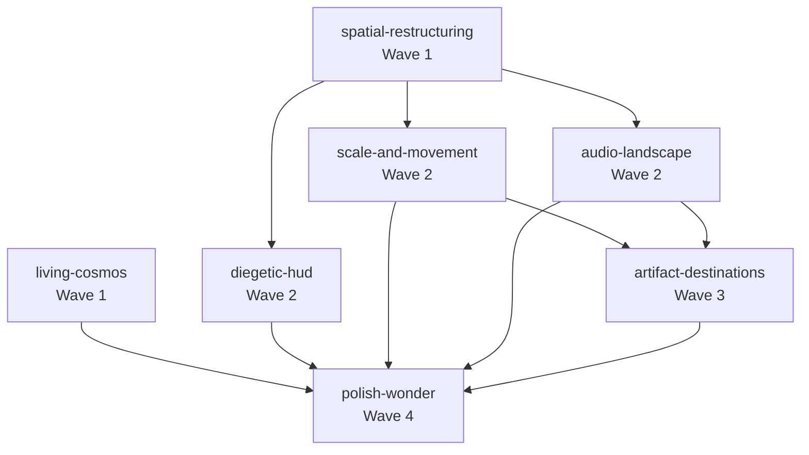

# Epic: Outer Wilds Transformation

**Created:** 2026-01-26
**Status:** planning
**Complexity:** Complex
**Thinking Level:** think-harder

## Overview

Transform the Mycelium Atlas from a tech demo into an Outer Wilds-inspired cosmic exploration experience. The cosmos should breathe with bioluminescent life, nodes should feel like destinations worth discovering, and the player should feel small in a vast but navigable universe.

**Core transformation:** From "functional 3D graph" to "wonder-filled cosmic journey."

**Design DNA (from Outer Wilds):**
- Diegetic UI — information exists in-universe, not overlaid
- Curiosity as sole motivation — wonder IS the reward
- Feeling small — tiny player in vast cosmos
- Systemic consistency — physics/audio rules apply universally
- Earned discovery — information reveals through approach

**Key Innovation:** Existing project artifacts (Teleodynamic Signature, Sympoietic Signature, Labyrinth Genesis) become discoverable destinations within the Atlas.

## Success Criteria

- [ ] Player feels small in vast, living cosmos (Stars, Sparkles, post-processing)
- [ ] Nodes distributed in true 3D space, not a flat plane
- [ ] Nodes feel like destinations (logarithmic scaling, approach reveals)
- [ ] HUD is minimal and contextual (no corner clutter, 3D beacons)
- [ ] Each biome has distinct audio signature
- [ ] Artifact portals are discoverable worlds within worlds
- [ ] Entry sequence creates sense of arrival
- [ ] 60fps maintained throughout
- [ ] Accessibility: reduced motion, keyboard navigation, mutable audio

---

## Dependency Graph

---

## Features

| Feature | Wave | Status | Plan | Depends On | Blocks |
|---------|------|--------|------|------------|--------|
| living-cosmos | 1 | pending | - | - | polish-wonder |
| spatial-restructuring | 1 | pending | - | - | scale-and-movement, diegetic-hud, audio-landscape |
| scale-and-movement | 2 | pending | - | spatial-restructuring | artifact-destinations, polish-wonder |
| diegetic-hud | 2 | pending | - | spatial-restructuring | polish-wonder |
| audio-landscape | 2 | pending | - | spatial-restructuring | artifact-destinations, polish-wonder |
| artifact-destinations | 3 | pending | - | scale-and-movement, audio-landscape | polish-wonder |
| polish-wonder | 4 | pending | - | ALL | - |

---

## Feature Descriptions

### Feature: living-cosmos (Wave 1)
**Purpose:** Create living, breathing visual cosmos
**Deliverables:**
- `<Stars>` component (5000 twinkling stars)
- `<Sparkles>` per biome (floating particles)
- `<EffectComposer>` with Bloom, Vignette, DOF
- NebulaBackdrop shader (subtle procedural clouds)
- Biome-responsive ambient lighting

**Provides to other features:**
- Post-processing pipeline for later effects
- Visual foundation for all other features

### Feature: spatial-restructuring (Wave 1)
**Purpose:** Transform flat distribution into true 3D cosmos
**Deliverables:**
- 4x scale increase (biome radius 30→120)
- Spherical node distribution per biome
- Vertical spread (Y-axis variety)
- Deep biome requires descent

**Provides to other features:**
- Biome centers for audio positioning
- 3D positions for beacon placement
- Navigation distances for movement tuning
- Portal positions in 3D space

### Feature: scale-and-movement (Wave 2)
**Purpose:** Make nodes feel like destinations, movement feel deliberate
**Deliverables:**
- Logarithmic node scaling (big at distance, huge up close)
- Slower base movement (0.8x current)
- Hyperdrive ceremony (longer warmup, dramatic FOV)
- Speed-responsive visitor trail

**Requires:**
- spatial-restructuring: 4x scale means movement params need recalibration

**Provides to other features:**
- Movement system for portal approach detection
- Hyperdrive for artifact portal entry

### Feature: diegetic-hud (Wave 2)
**Purpose:** Replace corner UI clutter with contextual 3D elements
**Deliverables:**
- Remove BiomePanel, PositionPanel from corners
- BiomeBeacons (3D markers in space)
- PeripheralGlow (edge glow for off-screen nodes)
- Contextual VelocityOrb and HyperdrivePanel

**Requires:**
- spatial-restructuring: Beacon positions depend on biome centers

### Feature: audio-landscape (Wave 2)
**Purpose:** Musical signatures that make the cosmos sing
**Deliverables:**
- Per-biome ambient audio (PositionalAudio from drei)
- CC-licensed audio assets acquired
- Node proximity audio (subtle tones)
- Hyperdrive audio arc (charge → travel → arrival)
- Discovery chimes

**Requires:**
- spatial-restructuring: Audio positioned at biome centers

**Provides to other features:**
- Audio infrastructure for portal discovery sounds
- Spatial audio patterns for artifact worlds

### Feature: artifact-destinations (Wave 3)
**Purpose:** Embed existing artifacts as discoverable worlds
**Deliverables:**
- ArtifactPortal component (special node type)
- PortalNode visual treatment (larger, orbital rings)
- TeleodynamicWorld (embed v8 artifact)
- SympoieticWorld (embed v3 artifact)
- LabyrinthPOVWorld (embed POV artifact)
- LabyrinthCoupledWorld (embed coupled artifact)
- Portal state management (enter/exit)
- Discovery ceremony per artifact

**Requires:**
- scale-and-movement: Portal approach uses movement system
- audio-landscape: Discovery sounds for portals

**Artifacts to integrate:**
- `artifacts/teleodynamic-signature-v8.jsx` → Deep biome
- `artifacts/sympoietic-signature-v3.jsx` → Reflection biome
- `artifacts/Labyrinth_particle-pov.html` → Deep biome (far)
- `artifacts/labyrinth-genesis-coupled.html` → Creation biome

### Feature: polish-wonder (Wave 4)
**Purpose:** Final touches for emotional resonance
**Deliverables:**
- Entry sequence (darkness → reveal)
- Cosmos breathing (8-second sync)
- First discovery moment (special reveal)
- Accessibility pass (reduced motion, keyboard, mutable audio)
- Performance optimization (particle LOD, audio pooling)

**Requires:**
- ALL previous features complete

---

## Execution Waves

### Wave 1
**Status:** pending
**Features:** living-cosmos, spatial-restructuring
**Parallel:** Yes (no interdependencies)

- [ ] living-cosmos planned
- [ ] spatial-restructuring planned
- [ ] Wave 1 execution complete
- [ ] Integration verified

### Wave 2
**Status:** pending
**Features:** scale-and-movement, diegetic-hud, audio-landscape
**Parallel:** Yes (all depend only on spatial-restructuring)

- [ ] scale-and-movement planned
- [ ] diegetic-hud planned
- [ ] audio-landscape planned
- [ ] Wave 2 execution complete
- [ ] Integration verified

### Wave 3
**Status:** pending
**Features:** artifact-destinations

- [ ] artifact-destinations planned
- [ ] Wave 3 execution complete
- [ ] Integration verified

### Wave 4
**Status:** pending
**Features:** polish-wonder

- [ ] polish-wonder planned
- [ ] Wave 4 execution complete
- [ ] Final integration verified

---

## Quality Gates

| Gate | Status | Passed At | Notes |
|------|--------|-----------|-------|
| Planning Complete | pending | - | All features planned, deps valid |
| Wave 1 Complete | pending | - | living-cosmos + spatial-restructuring |
| Wave 2 Complete | pending | - | scale, hud, audio |
| Wave 3 Complete | pending | - | artifact-destinations |
| Wave 4 Complete | pending | - | polish-wonder |
| Epic Complete | pending | - | Full integration, success criteria |

---

## Research Assets (Already Compiled)

### External Libraries
- drei: Stars, Sparkles, PositionalAudio, Environment
- @react-three/postprocessing: Bloom, Vignette, DOF, GodRays
- Tone.js: Web Audio synthesis

### CC-Licensed Audio Sources
- Scott Buckley, Free Music Archive, OpenGameArt (CC0)
- Looperman, Ambient-Mixer, LonePeakMusic, Mixkit

### Project Artifacts (Destinations)
- teleodynamic-signature-v8.jsx (1330 lines)
- sympoietic-signature-v3.jsx (1057 lines)
- Labyrinth_particle-pov.html (242KB)
- labyrinth-genesis-coupled.html (51KB)

### Gemini's Research
- research/samsy_shaders.glsl (58KB shader patterns)
- research/bruno_shaders.glsl (loop/time patterns)

---

## Recovery

If context is lost, read this file and `state.json` to recover position.

**Current position:** Phase 1 Architecture, creating workspace

**Last action:** Epic workspace created, master.md written

**Next action:** Create state.json, then proceed to Phase 2 (Feature Planning)

---

## Log

| Date | Action | Result |
|------|--------|--------|
| 2026-01-26 | Epic recognized (Phase 0) | Complex, 7 features, think-harder |
| 2026-01-26 | Workspace created (Phase 1) | docs/epics/2026-01-26-outer-wilds-transformation/ |
| 2026-01-26 | master.md written | Dependencies mapped, 4 waves |
